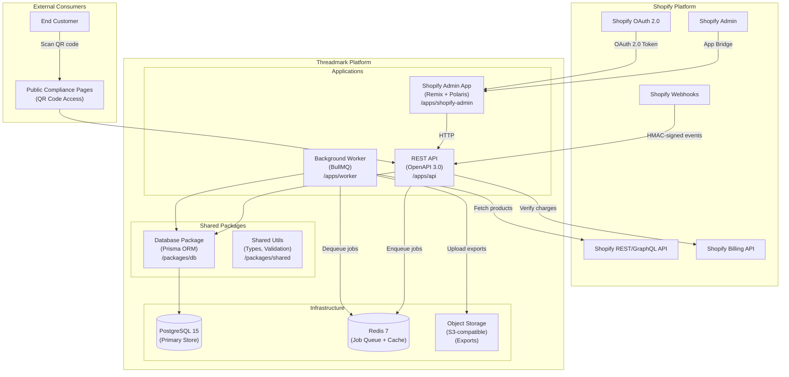
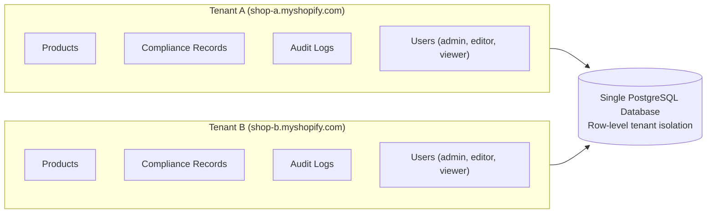
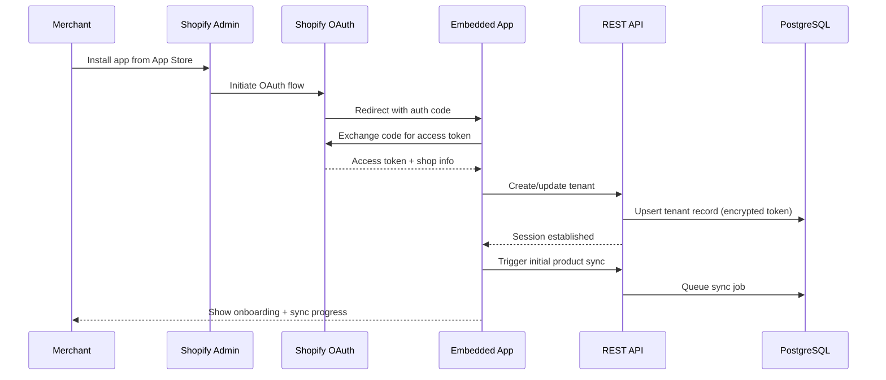
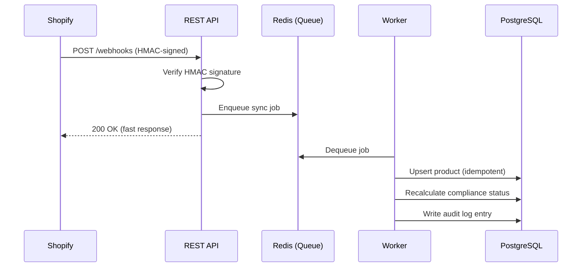
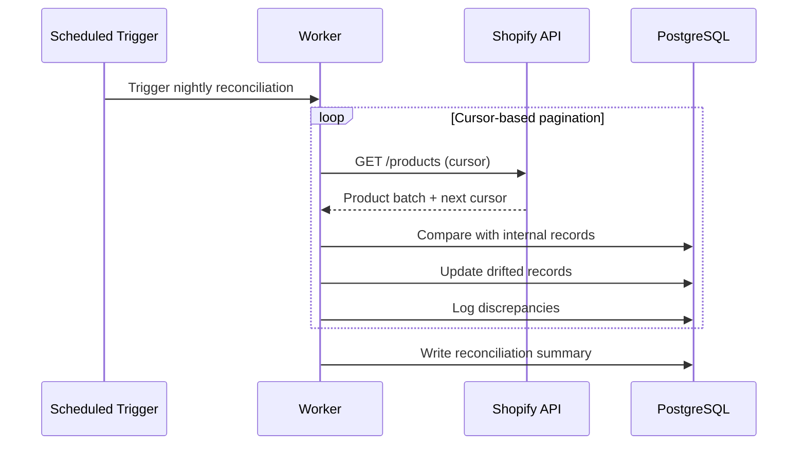
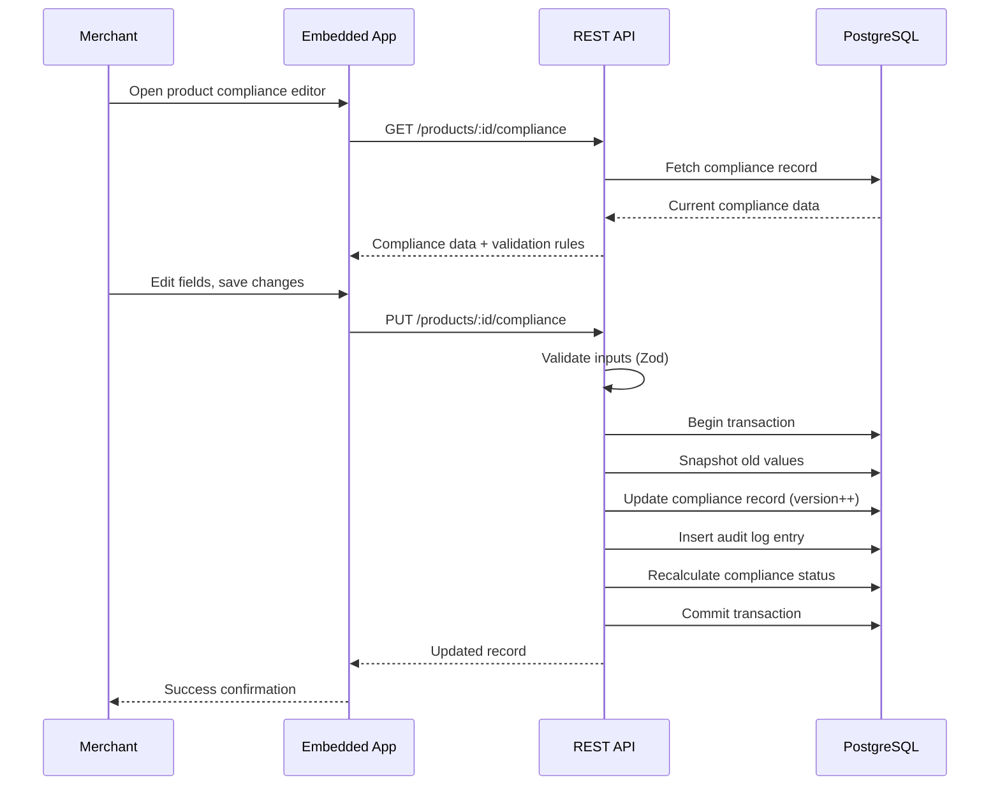
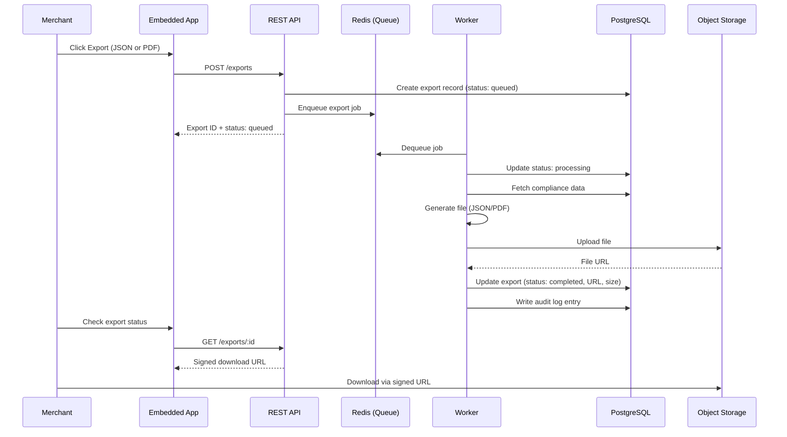

# System Architecture

## System Overview

## Component Descriptions

| Component | Workspace | Purpose |
|-----------|-----------|---------|
| Shopify Admin App | `/apps/shopify-admin` | Remix embedded app with Polaris UI. Handles OAuth, session management, and compliance data editing UI. Runs inside Shopify Admin via App Bridge. |
| REST API | `/apps/api` | OpenAPI 3.0 REST API. Handles webhook ingestion, CRUD operations, RBAC enforcement, audit logging, and serves public compliance pages. |
| Background Worker | `/apps/worker` | BullMQ-based job processor. Handles product sync (webhook + scheduled reconciliation), export generation (JSON/PDF), and data retention cleanup. |
| Database Package | `/packages/db` | Prisma ORM schema, migrations, and client. Shared across API and Worker. |
| Shared Package | `/packages/shared` | Shared TypeScript types, validation schemas (Zod), constants, and utility functions. |
| PostgreSQL | Docker / Cloud | Primary data store. ACID-compliant. Stores tenants, products, compliance records, audit logs, users, and exports. |
| Redis | Docker / Cloud | Job queue backing store (BullMQ). Also used for rate limiting (token bucket) and session caching. |
| Object Storage | S3-compatible | Stores generated export files (JSON, PDF). Serves via signed URLs with configurable expiry. |

## Multi-Tenancy Model

All data is isolated at the shop (tenant) level. Every table except `tenants` includes a `tenant_id` foreign key. Queries are scoped to the authenticated tenant via middleware.

## RBAC Model

| Role | Products | Compliance Data | Exports | Audit Logs | Settings |
|------|----------|----------------|---------|------------|----------|
| Admin | Read | Read / Write | Create / Download | Read | Read / Write |
| Editor | Read | Read / Write | Create / Download | Read | Read |
| Viewer | Read | Read | Download | Read | Read |

---

## Data Flow Diagrams

### 1. OAuth Installation and Authentication

### 2. Product Sync (Webhook-Triggered)

### 3. Product Sync (Scheduled Reconciliation)

### 4. Compliance Data Editing with Audit Trail

### 5. Export Generation and Delivery

---

## Environments

| Environment | Purpose | Infrastructure |
|-------------|---------|---------------|
| Development | Local dev machines | Docker Compose (Postgres + Redis), Shopify CLI tunnel |
| Staging | Pre-production testing | Cloud-hosted, test Shopify store |
| Production | Live merchant data | Cloud-hosted, live Shopify stores |

Configuration is managed via environment variables injected through CI/CD secrets.

## Cross-Cutting Concerns

| Concern | Approach |
|---------|----------|
| Logging | Structured JSON logs with correlation IDs and log levels |
| Metrics | Prometheus-compatible metrics or APM integration |
| Tracing | OpenTelemetry for distributed tracing (optional v1) |
| Rate Limiting | Per-tenant and global limits via Redis-backed token bucket |
| Input Validation | Centralized Zod schemas in `@threadmark/shared` |
| Error Handling | Structured error responses with correlation IDs |

## Technology Decisions

| Decision | Choice | Rationale |
|----------|--------|-----------|
| Monorepo Tool | Turborepo | Lightweight, fast caching, good npm workspace integration |
| ORM | Prisma | Type-safe client generation, migration tooling, schema-first design |
| Database | PostgreSQL 15 | ACID compliance, JSONB for structured compliance data, audit trail support |
| Job Queue | BullMQ (Redis-backed) | Reliable job processing, retries, scheduling, dashboard |
| Frontend Framework | Remix | Shopify's recommended framework for embedded apps |
| UI Components | Polaris | Shopify's design system for admin apps |
| Validation | Zod | TypeScript-first schema validation, composable, good error messages |
