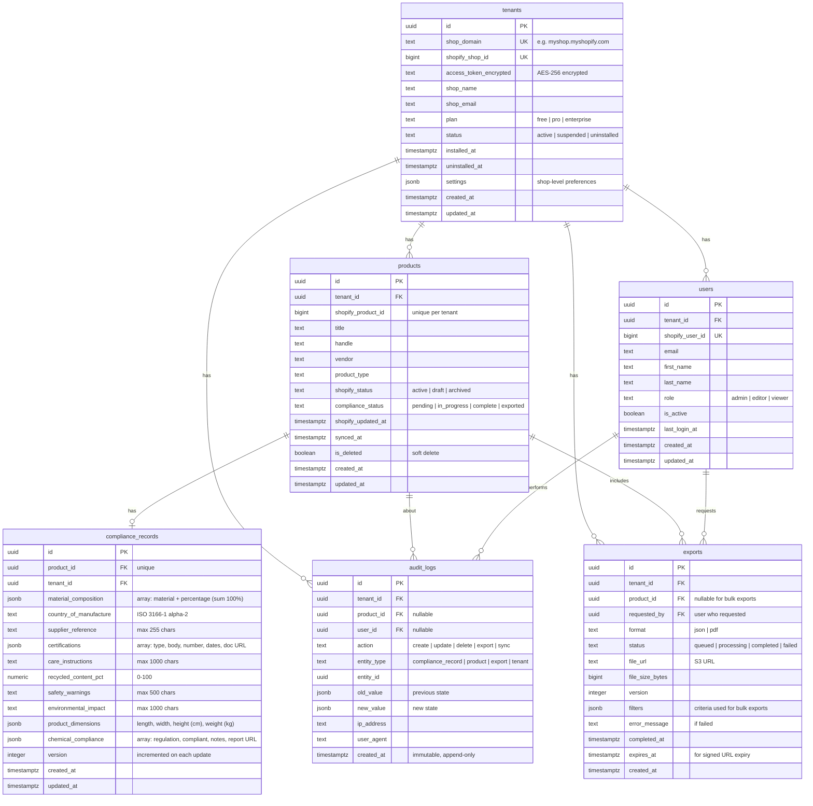

# Entity Relationship Diagram

## Mermaid ERD

## Table Descriptions

### tenants
Represents a Shopify shop installation. Each shop is an isolated tenant. Stores encrypted access tokens and shop metadata. Row-level tenant isolation is enforced via `tenant_id` on all other tables.

### products
Mirrors Shopify products via webhook sync. Tracks both Shopify status and internal compliance status. Supports soft deletion (`is_deleted`) so compliance records are preserved when a Shopify product is deleted.

### compliance_records
One-to-one with products. Stores all 10 compliance attributes defined in the PRD. Structured/list fields (material composition, certifications, chemical compliance, product dimensions) use JSONB columns. Includes a `version` counter incremented on each update.

### audit_logs
Append-only table recording all compliance data changes. No UPDATE or DELETE operations permitted. Captures who changed what, when, with before/after snapshots in JSONB. Supports querying by tenant, product, user, action type, or time range.

### users
Shopify users associated with a tenant. Supports three roles: `admin` (full access), `editor` (read/write compliance data), `viewer` (read-only). Role is used by RBAC middleware for authorization.

### exports
Tracks export requests and their lifecycle (queued, processing, completed, failed). Supports both single-product and bulk exports in JSON or PDF format. Files are stored in S3 with expiring signed URLs.

## Key Indexes

| Table | Columns | Purpose |
|-------|---------|---------|
| products | `(tenant_id, shopify_product_id)` UNIQUE | Prevent duplicate products per tenant |
| products | `(tenant_id, compliance_status)` | Dashboard filtering |
| products | `(tenant_id, is_deleted)` | Exclude soft-deleted from queries |
| compliance_records | `(product_id)` UNIQUE | One record per product |
| compliance_records | `(tenant_id)` | Tenant-scoped queries |
| audit_logs | `(tenant_id, created_at)` | Tenant audit history |
| audit_logs | `(product_id, created_at)` | Product change history |
| users | `(tenant_id, shopify_user_id)` UNIQUE | Unique user per tenant |
| exports | `(tenant_id, created_at)` | Export history |

## Constraints

- All tables use UUIDs as primary keys (v4)
- `tenant_id` is required on every table except `tenants` itself
- `audit_logs` has no UPDATE/DELETE triggers — enforced at application level and via DB rule
- `compliance_records.material_composition` percentages must sum to 100 (validated at application level)
- `compliance_records.recycled_content_pct` constrained to 0-100
- `compliance_records.version` starts at 1 and increments with each update
- `products.(tenant_id, shopify_product_id)` is unique
- All timestamps use `timestamptz` (timezone-aware)
